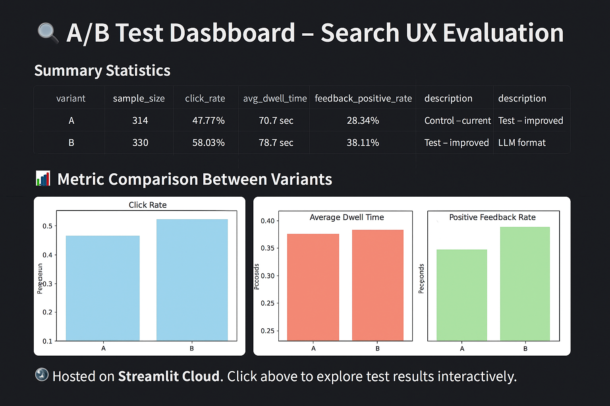

---
title: "A/B Test Dashboard – Search UX Evaluation"
author: "Atila Madai"
date: 2025-07-01
categories: [A/B Testing, notebook, python]
tags: [python, notebook]
jupyter:
  kernelspec:
    name: python3
    display_name: "Python 3"
    language: python

format:
  html:
    code-fold: true
    toc: true
    toc-location: left
    page-layout: article

execute:
  freeze: false
---

## 🧪 Overview

This post summarizes an A/B test comparing two variants of a search experience using real usage logs. The goal was to evaluate:

- Click engagement
- User dwell time
- Positive feedback rate

The full analysis is available via an interactive dashboard.

## 🔗 Interactive Dashboard

[](https://abtestdashboard-8bfxncyzrn8ksjf7maaqcq.streamlit.app/)

> 📊 Hosted on Streamlit Cloud. Click above to explore test results interactively.

---

## 🧮 Experiment Design

We compared:

- **Variant A**: Control – current production layout
- **Variant B**: Test – new LLM-enhanced formatting

Session-level metrics were computed and compared using independent t-tests and Mann–Whitney U tests.

---

## 📈 Metric Summary

```{python}
import pandas as pd

# Load previously exported summary from the notebook
df = pd.read_csv("data/metric_summary.csv")

# Rename and organize columns for presentation
df = df.rename(columns={
    "variant": "Variant",
    "description": "Description",
    "click_rate": "Click Rate",
    "avg_dwell_time": "Dwell Time (s)",
    "feedback_positive_rate": "Positive Feedback",
    "click_rate_p_value": "Click Rate p",
    "dwell_time_p_value": "Dwell Time p",
    "feedback_score_p_value": "Feedback p"
})

# Format for presentation
df.set_index("Variant").style.format({
    "Click Rate": "{:.2%}",
    "Dwell Time (s)": "{:.1f}",
    "Positive Feedback": "{:.2%}",
    "Click Rate p": "{:.2e}",
    "Dwell Time p": "{:.2e}",
    "Feedback p": "{:.2e}"
})
```

---

## 🔍 Observations

- **Click Rate** improved significantly in the new variant.
- **Dwell Time** showed a small, non-significant increase.
- **Positive Feedback** rate increased and was statistically significant.

---

## 🛠 Reproducibility

The dashboard was built using:

- `streamlit`, `pandas`, `plotly`, `scipy`
- Supports data uploads in `.csv`, `.xlsx`, `.parquet`, `.db`

Source code available on [GitHub](https://github.com/atimad/ab_test_dashboard).

---

## 📌 Future Work

- JSON & API integration for real-time experiment ingestion
- Support for multiple test variants
- Trend analysis across time windows
