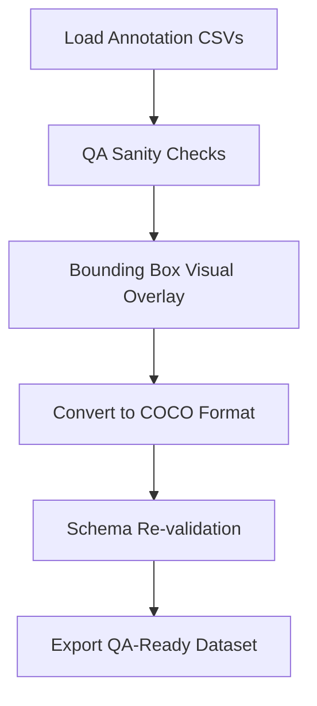

# ✈️ Computer Vision QA Assessment for Airport Apron Annotation Pipelines

## 📘 Introduction

This notebook provides a robust framework for performing **quality assurance (QA)** on annotated image datasets used in **computer vision (CV) pipelines** for airport apron operations. These operations involve detecting and tracking aircraft, vehicles, ground crew, and equipment to ensure timely and safe turnaround processes. Reliable annotation is critical in such safety-critical environments, where every mislabeled object or faulty bounding box can undermine model accuracy and operational trust.

We focus on a synthetic dataset representing apron scenarios, using per-frame CSV annotations. The QA framework evaluates the correctness of bounding boxes, label consistency, and visual alignment before converting the data into the **COCO** format—a widely used standard for training object detection models.

## 🧠 Techniques Used

- **CSV Parsing (via `pandas`)**: Structured loading of annotation files
- **Bounding Box QA Checks**: Ensure spatial validity and logical coherence
- **Visual Validation**: Overlay annotations on images for human-in-the-loop inspection
- **COCO Format Conversion**: Interoperable export for ML pipelines
- **Schema Revalidation**: Final consistency checks after format transformation

## 🗂 Dataset Description

The dataset includes synthetic images of airport apron scenes and CSV annotation files with the following structure:

- `frame_id`: Frame number or timestamp
- `object_id`: Unique identifier per object
- `object_type`: Class label (e.g., 'aircraft', 'baggage_cart', 'person')
- `x_min, y_min, x_max, y_max`: Bounding box coordinates

## 📐 Pipeline Flow



## 🔬 Literature & Standards

- Wang et al. (2022). *Airport Apron Monitoring Using Deep Learning on Synthetic Imagery*. [DOI:10.3390/s22082983](https://doi.org/10.3390/s22082983)
- Chen et al. (2023). *Foreign Object Detection for Airport Runways Using YOLO*. [IEEE Access](https://ieeexplore.ieee.org/document/10067897)
- Raza et al. (2021). *Visual QA for Surveillance in Critical Infrastructure*. [arXiv:2105.11100](https://arxiv.org/abs/2105.11100)

## ✅ Outcome

At the end of this notebook, we will have:
- Validated bounding box annotations
- Visual verification of object labeling
- Exported a clean, COCO-compatible dataset

This workflow provides a reliable, repeatable QA process that can be adapted to other CV use cases in airside, industrial, or transportation domains.


# 🧪 ML QA & Monitoring for Real-Time Computer Vision
This notebook simulates quality assurance logic for real-time CV pipelines, focusing on monitoring inference confidence, detecting model drift, applying anomaly detection techniques, and tracking experiments using MLflow.

```{python}
import pandas as pd
import numpy as np
import matplotlib.pyplot as plt
from sklearn.ensemble import IsolationForest
```

## 📥 Load Inference Data

```{python}
data = pd.read_csv('../../_data/CV/synthetic_cv_data.csv')
data['timestamp'] = pd.to_datetime(data['timestamp'])
data.head()
```

## 📉 Confidence Score Monitoring
Visualize the rolling confidence mean to detect potential drift.

```{python}
rolling_avg = data['confidence'].rolling(50).mean()

plt.figure(figsize=(12, 5))
plt.plot(data['timestamp'], data['confidence'], alpha=0.3, label='Confidence')
plt.plot(data['timestamp'], rolling_avg, color='red', label='Rolling Mean (50)')
plt.axhline(0.6, linestyle='--', color='gray', label='Alert Threshold')
plt.legend()
plt.title('Confidence Score Over Time')
plt.xlabel('Timestamp')
plt.ylabel('Confidence')
plt.show()
```

## 🚨 Alert Trigger

```{python}
if rolling_avg.iloc[-1] < 0.6:
    print("⚠️ ALERT: Confidence degradation detected!")
else:
    print("✅ System performance is stable.")
```

## 🤖 Anomaly Detection via Isolation Forest

```{python}
features = data[['bbox_area', 'confidence']]
model = IsolationForest(contamination=0.05, random_state=42)
data['anomaly'] = model.fit_predict(features)
data['anomaly'] = data['anomaly'].map({1: 'Normal', -1: 'Anomaly'})
data['anomaly'].value_counts()
```

## 🔍 Visualize Anomalies

```{python}
plt.figure(figsize=(12, 5))
colors = {'Normal': 'blue', 'Anomaly': 'red'}
for label, group in data.groupby('anomaly'):
    plt.scatter(group['timestamp'], group['confidence'], c=colors[label], label=label, alpha=0.6)
plt.title('Detected Anomalies in Confidence')
plt.xlabel('Timestamp')
plt.ylabel('Confidence')
plt.legend()
plt.show()
```

## 📦 MLflow Logging
Log model parameters, performance metrics, and version metadata using MLflow.

```{python}
import mlflow
import mlflow.sklearn

# Start an MLflow run
with mlflow.start_run(run_name="cv_qa_drift_monitoring"):
    mlflow.log_param("model_type", "IsolationForest")
    mlflow.log_param("contamination", 0.05)
    mlflow.log_metric("anomaly_count", (data['anomaly'] == "Anomaly").sum())
    mlflow.log_metric("mean_confidence", data['confidence'].mean())
    mlflow.log_metric("rolling_avg_last", rolling_avg.iloc[-1])
    mlflow.sklearn.log_model(model, "model")
    mlflow.set_tag("version", "v1.0")
    mlflow.set_tag("context", "QA pipeline drift detection")

print("✅ MLflow run logged.")
```

## 🧩 Simulated `kubectl` Logs for ML System Monitoring
Real-time ML pipelines are often deployed in Kubernetes pods. QA engineers frequently inspect pod logs and system status using `kubectl`. Below is a simulated log parser that mimics reading pod health and anomaly alerts from a log file.

```{python}
import time

# Simulated kubectl logs (mocked string output)
kubectl_logs = """
[2025-06-20 08:01:13] pod/vision-inferencer Ready
[2025-06-20 08:01:19] INFO: Inference pipeline started.
[2025-06-20 08:01:22] WARN: Confidence dropped below 0.65
[2025-06-20 08:01:25] ALERT: Detected anomaly cluster in frame stream 41
[2025-06-20 08:01:30] pod/vision-inferencer Healthy
"""

# Display line-by-line to mimic real-time stream
for line in kubectl_logs.strip().split('\n'):
    print(line)
    time.sleep(0.3)
```

## ✅ Next Steps
- Monitor system metrics via Prometheus/Grafana
- Deploy QA checks in CI/CD with pytest
- Integrate tracking with MLflow and experiment registry
- Simulate larger datasets with DVC for long-term monitoring
